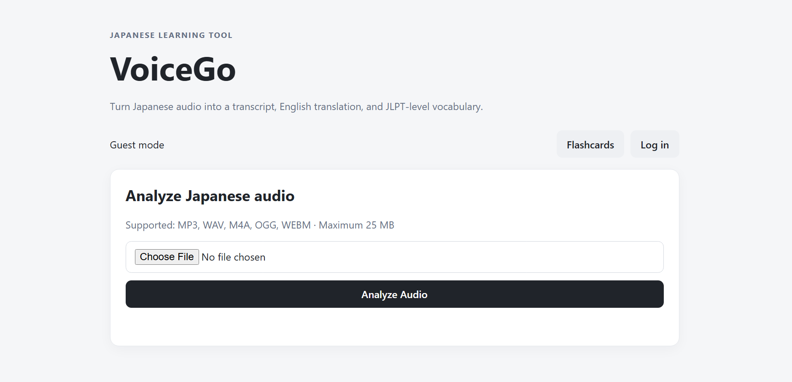
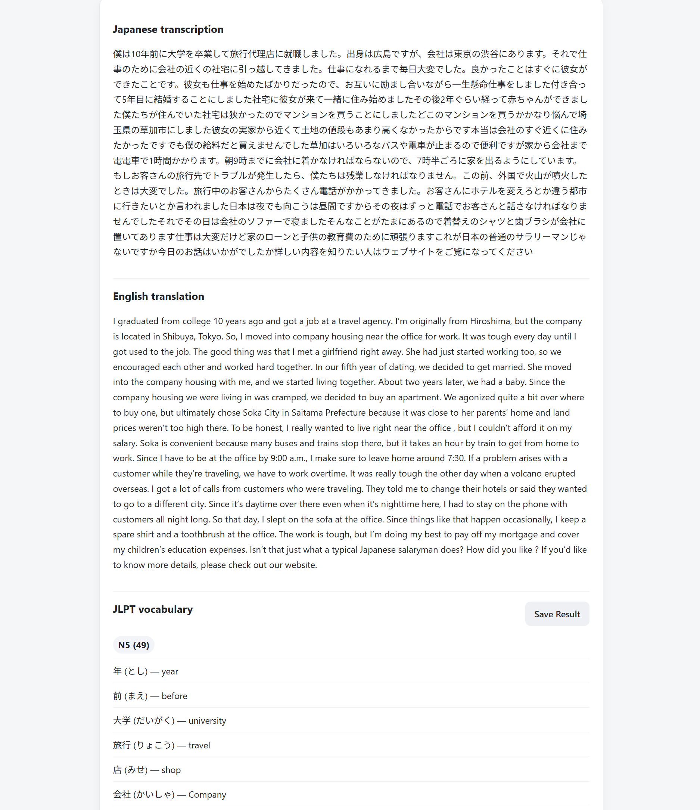
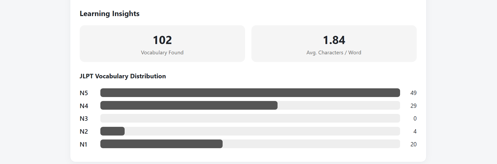
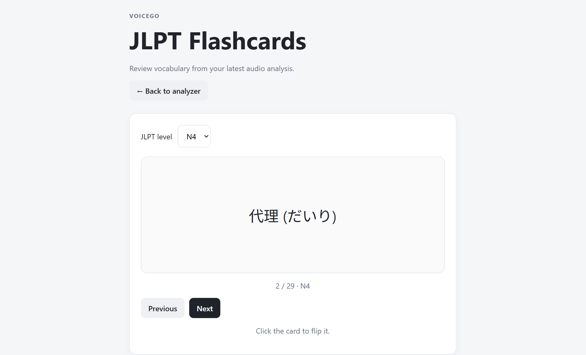
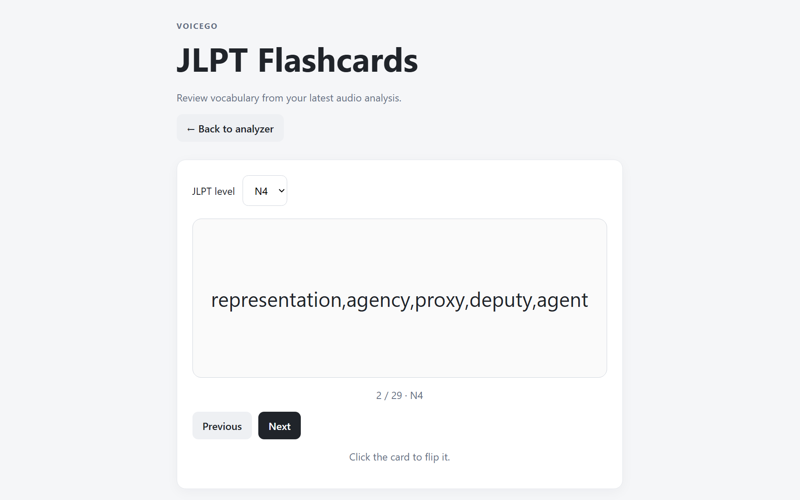

# VoiceGo 

**VoiceGo** is a Japanese audio analysis web application that helps learners analyze spoken Japanese by converting audio into text, translating the transcription, and identifying useful vocabulary.

The project combines **speech-to-text, natural language processing, vocabulary analysis, and a web interface** to provide a simple Japanese learning workflow.

**Access it here**: [VoiceGo](https://voicego-2fw7.onrender.com/)
(The sample file used below is in this <audio controls src="https://archive.org/details/jlpt-stories/%2309+-+%E5%83%95%E3%81%AE%E5%A4%A7%E5%88%87%E3%81%AA%E5%AE%B6%E6%97%8F+%E2%80%93+JLPT+N4.mp3" title="link, number 6"></audio> )
## Features

* Upload Japanese audio files for analysis
* Convert Japanese speech to text using Whisper
* Translate Japanese transcriptions into English
* Extract and identify Japanese vocabulary
* Match extracted vocabulary with JLPT-level information
* Generate vocabulary flashcards
* Filter extracted words to focus on useful vocabulary
* Simple web interface for interacting with the analysis pipeline

## Audio Analysis Pipeline

VoiceGo processes uploaded Japanese audio through several stages:

1. **Audio Upload** – The user uploads a supported audio file.
2. **Speech-to-Text** – Japanese speech is transcribed using **Whisper**.
3. **Translation** – The Japanese transcription is translated into English using **DeepL**.
4. **Text Processing** – The Japanese transcription is analyzed and tokenized using **fugashi**.
5. **Vocabulary Matching** – Extracted words are compared against a Japanese vocabulary database stored in **Supabase**.
6. **Learning Output** – Relevant vocabulary is displayed with information such as reading, English meaning, and JLPT level.

This creates a data pipeline that transforms raw audio into structured learning information.

## Data Processing

VoiceGo uses natural language processing techniques to extract useful information from Japanese transcriptions.

The application:

* Tokenizes Japanese text
* Identifies vocabulary from the transcription
* Filters out punctuation and less useful grammatical elements
* Removes unnecessary one-character hiragana
* Matches extracted words against a vocabulary dataset
* Associates vocabulary with JLPT difficulty levels

The vocabulary data is stored in a **Supabase PostgreSQL database** and queried when analyzing a transcription.

## Database

VoiceGo uses **Supabase** to store Japanese vocabulary data.

The vocabulary dataset contains information such as:

* Japanese kanji
* Hiragana readings
* English meanings
* JLPT levels

The database allows the application to dynamically match words found in user transcriptions with vocabulary information.

## AI / NLP Technologies

VoiceGo uses several technologies to process and analyze Japanese audio:

| Technology    | Purpose                               |
| ------------- | ------------------------------------- |
| **Whisper**   | Japanese speech-to-text transcription |
| **DeepL API** | Japanese-to-English translation       |
| **fugashi**   | Japanese text tokenization            |
| **Supabase**  | Vocabulary database and data storage  |

## Tech Stack

| Technology     | Purpose                         |
| -------------- | ------------------------------- |
| **Python**     | Backend and data processing     |
| **FastAPI**    | Backend / API framework         |
| **Whisper**    | Speech-to-text                  |
| **DeepL API**  | Translation                     |
| **fugashi**    | Japanese NLP / tokenization     |
| **Supabase**   | Database and vocabulary storage |
| **HTML/CSS**   | User interface                  |
| **JavaScript** | Frontend functionality          |
| **Git/GitHub** | Version control                 |
| **Render**     | Application deployment          |

## Application

### Home Page



### Audio Analysis



### Vocabulary Analysis



### Flashcards




## Running Locally

### Prerequisites

* Python 3.10+
* A Supabase project
* A DeepL API key
* A Groq API key

### Setup

1. Clone the repository:

```bash
git clone https://github.com/lphuong25/VoiceGo.git
cd VoiceGo
```

2. Create and activate a virtual environment:

```bash
python -m venv .venv
```

On Windows:

```bash
.venv\Scripts\activate
```

3. Install the required dependencies:

```bash
pip install -r requirements.txt
```

4. Create a `.env` file based on `.env.example`.

5. Add your API keys and Supabase configuration.

6. Start the FastAPI application:

```bash
uvicorn main:app --reload
```

7. Open the application in your browser.

> **Note:** API keys and database credentials are not included in this repository. Create your own environment configuration using the example below.

## Environment Variables

Create a `.env` file example below and provide your own credentials.

Example:

```env
GROQ_API_KEY=your_groq_api_key
DEEPL_API_KEY=your_deepl_api_key

SUPABASE_URL=your_supabase_url
SUPABASE_KEY=your_supabase_key
```

**Never commit** **`.env`** **or other files containing real credentials to GitHub.**

## Deployment

The application is currently deployed using **Render** for demonstration purposes.

The deployed application connects to the Supabase database for vocabulary lookup and uses external APIs for speech-to-text and translation.

## Future Improvements

Possible future improvements include:

* Add log in function
* Add learning history and user progress tracking
* Add vocabulary difficulty and frequency analysis
* Provide statistics about vocabulary found in uploaded audio
* Add additional JLPT vocabulary levels
* Improve Japanese vocabulary extraction and grammatical filtering
* Add more detailed learning analytics
* Allow users to save and review previously analyzed vocabulary

## Project Context

VoiceGo was developed as a personal project to explore the use of **data processing, natural language processing, and AI APIs** in an educational application.

The project provided hands-on experience with:

* Python backend development
* REST API development
* Speech-to-text processing
* Japanese natural language processing
* Data cleaning and transformation
* Database integration
* API integration
* Building a data-driven web application
* Cloud deployment

## License

This project was created for educational and portfolio purposes.
